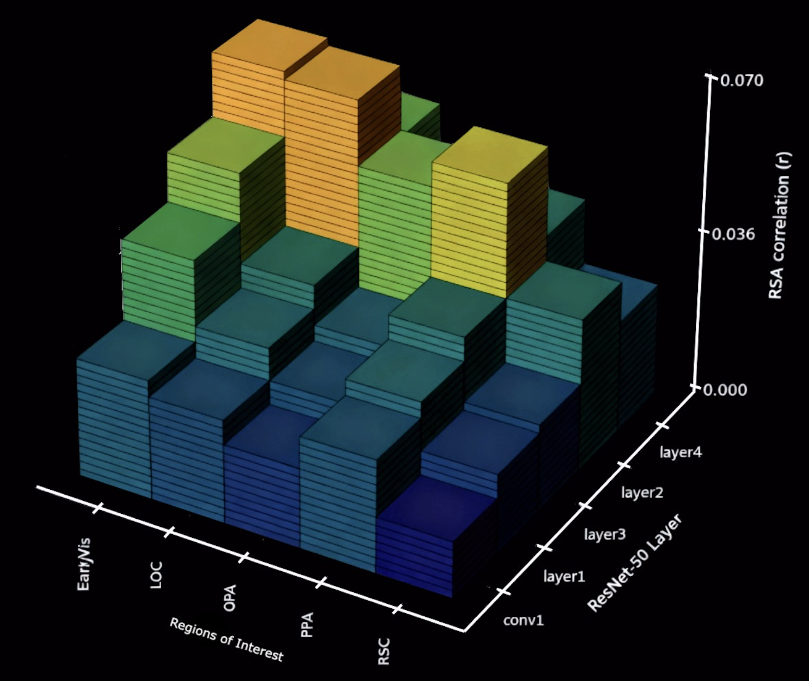

# RSA Analysis: ResNet-50 vs BOLD5000


This repository compares **ResNet-50 model RDMs** with **human fMRI responses** from the **BOLD5000 dataset** using **Representational Similarity Analysis (RSA)** (Kriegeskorte, Mur & Bandettini, 2008).

This is an exploratory analysis and was conducted as a passion project which would not have been possible without Heiko H Schütt's *Tutorial on Statistical Inference On Representational Geometries* at NYU MITCBMM and Demos provided RSA toolbox by the RSA development group (van den Bosch et al., 2025).

van den Bosch, J. J., Golan, T., Peters, B., Taylor, J., Shahbazi, M., Lin, B., Charest, I., Diedrichsen, J., Kriegeskorte, N., Mur, M., & Schuett, H. (2025). A Python Toolbox for Representational Similarity Analysis. bioRxiv. https://doi.org/10.1101/2025.05.22.655542

Heiko H Schütt Alexander D KipnisJörn DiedrichsenNikolaus Kriegeskorte (2023) Statistical inference on representational geometries eLife 12:e82566. https://doi.org/10.7554/eLife.82566

---


## Contents

1. [Motivation](#motivation)
2. [Visual Hierarchy - ROIs](#Regions-of-Interest)
3. [Representational Similarity Analysis (RSA)](#representational-similarity-analysis)
4. [Data](#data)
5. [Methods & Key Findings](#Methods-and-Key-Findings)
6. [Visualisations - per subject](#heatmap-and-bar-plot-Visualisations-of-pearson-r-correlation-per-each-Subject)
7. [References](#references)


---

## Motivation

Being able to analyse how **deep neural networks (DNNs)** mirror human visual processing is a key question in **computational neuroscience** and **NeuroAI** which draws on much broader questions towards interperable/ biological analysis of DNN architecture.

## Regions of Interest

This table summarizes approximate onset latencies for key visual cortical areas in humans after seeing a stimulus. Latencies are based on EEG, MEG, and iEEG studies.

| Area | Approximate Onset / Selectivity Latency | Notes & References |
|------|-----------------------------------------|------------------|
| **V1** | ~30–60 ms | Earliest cortical activation measured with MEG/VEF; feedforward processing of low-level visual features (Foxe & Simpson, 2002; Di Russo et al., 2002). |
| **V2** | ~30–70 ms | Latencies closely approximated to V1; macaque studies show similar onset timing between V1 and V2 neurons (Schmolesky et al., 1998; Nowak et al., 1995). |
| **LOC (Lateral Occipital Complex)** | ~160–300 ms | Studies show object & shape selectivity ~230 ms; In line with TMS studies involvement ~160–200 ms (Kourtzi & Kanwisher, 2000; Carlson et al., 2013). |
| **PPA (Parahippocampal Place Area)** | ~80–170 ms | Intracranials show early scene and place discrimination (~80–170 ms) depending on stimulus type/ PPA sub-region (Rajimehr et al., 2011; Golarai et al., 2010). |
| **OPA (Occipital Place Area)** | ~240–300 ms | iEEG and MEG indicate scene layout discrimination in OPA emerges ~242–300 ms (Kamps et al., 2016; Baldassano et al., 2016). |
| **RSC (Retrosplenial Complex)** | Poorly characterized: >400 ms | RSC relates to memory/navigation and allocentric coding; human onset latencies for visual stimuli are sparse therefor we do not expect to see much activation due to data and experiment collection (example: Epstein, 2008; Vann et al., 2009). |


- **Early visual areas (V1/V2)**
- **Mid-level visual areas (LOC, OPA)**
- **High-level scene/object areas (PPA, RSC)**
- **Layer-wise representations of ResNet-50 (5-Layers)**

### Representational Similarity Analysis

RSA first proposed and devised by Kriegeskorte, Mur & Bandettini (2008) addresses the corresponsancy problem of analysisng and comparing multi-modal imaging and data gathering types for brain imaging, behaviour, and cross specie comparisons. RSA is used by abstracting activity patterns via representational dissimilarity matrices (RDMs) using a "common currency" of pairwise dissimilarities across subject data. This approach ables the RSA to accounting for varying model/brain dimensionality, scale and noise of varying activity patterns allowing for direct comparison of cross-modal data. Seyed‑Mahdi Khaligh‑Razavi & Nikolaus Kriegeskorte (2014) well regarded study applieed the RSA to compare 37 computational vision models and their representations in primate IT cortex. The subsequent "suprising" similarity of adjacent studies and their equivalent findings (Kriegeskorte, 2015) allowed for new lines of research comparing neural networks with biological systems.
 
---

## Data

This analysis uses data from the BOLD5000 ROIs and RDMs for >400 *Neural Network Research dataset* (Pickard et al., 2023), developed from BOLD5000 Release 2.0 (Chang et al., 2021). This dataset extends the original by providing new region-of-interest (ROI) definitions, beta activation Vs, and representational dissimilarity matrices (RDMs). Our study did not compute RDM Corrs due to limited Brain and DNN stimuli correlation and computational limits.

- **BOLD5000 fMRI dataset**: preprocessed ROI-level RDMs per subject
- **ResNet-50**: precomputed RDMs for each convolutional block/layer 
- **Images**: 2985 images shared across subjects and model for alignment  
- **ROIs**: 10 cortical regions, including EarlyVisual, LOC, OPA, PPA, RSC categorised by hemisphere lateralisation (L/R) 

**Note**: The repository does **not** include raw MRI or image data due to size and licensing restrictions. Scripts expect data paths for `.h5` files.

Full dataset available on Dryad: [https://doi.org/10.5061/dryad.wpzgmsbtr](https://doi.org/10.5061/dryad.wpzgmsbtr)

### Datasets used for this study
DNN:
- ResNet50_CORR_RDMs.h5
Participants:
- CSI1_BOLD5000_CORR_RDMs.h5 (*subject 1*)
- CSI2_BOLD5000_CORR_RDMs.h5 (*subject 2*)
- CSI3_BOLD5000_CORR_RDMs.h5 (*subject 3*)

---

## Methods and Key Findings

#### ROI RDMs from BOLD5000 fMRI data were aligned with ResNet-50 model RDMs using 2985 common images across subjects.

```python
aligned_rdms_BRAIN = rdms_data.subset_pattern('image', common_patterns)
aligned_rdms_DNN = rdms_model.subset_pattern('image', common_patterns)
```

#### 2. Fixed-model RSA was computed per ROI with eval_fixed(models, brain_rdm, method='corr'). Initial Analysis conducted RSA per subject, subsequent analyses grouped subject by shared stimuli type. One subject from the Pickard et al., (2023) was excluded due to limited sampling.

```python
# RSA per each Subject
all_corrs = [
    {"Subject": s, "ROI": r, "Layer": m.name, "r": v}
    for s, roi_rdms in subjects.items()
    for r, brain_rdm in roi_rdms.items()
    for m, v in zip(models, np.array(inference.eval_fixed(models, brain_rdm, method='corr').evaluations).flatten())
]

# RSA Averaged Across All Subjects combined
joint_corrs = []
for roi in subjects['subj1']:
    avg_rdm = rdm.RDMs(
        np.mean([subjects[s][roi].dissimilarities[0] for s in subjects], axis=0)[np.newaxis, :],
        dissimilarity_measure='correlation',
        pattern_descriptors={'image': common_patterns},
        rdm_descriptors={'roi': [roi]}
    )
    joint_corrs.extend(
        {"ROI": roi, "Layer": m.name, "r": v}
        for m, v in zip(models, np.array(inference.eval_fixed(models, avg_rdm, method='corr').evaluations).flatten())
    )
```
## Inferential Statistics Section

ROIs were dditionally grouped hierarchically as per initial literature review, this was done to better visualise RSA relationship (see section on Visual System Hierarchical Latencies)

Early visual: LHEarlyVis, RHEarlyVis
Mid-level: LHLOC, RHLOC, LHOPA, RHOPA
High-level: LHPPA, RHPPA, LHRSC, RHRSC

Mean ± SEM correlations were calculated across subjects and visualized via heatmaps, line plots, and scatter plots across layers.

## Key Findings

#### 1. Layer 3 of ResNet-50 shows the strongest RSA r- correlation across all ROIs, indicating it the most representially similar to the human visual cortex in this analysis.
#### 2. Early visual areas (V1/V2) aligned most closely with lower to mid-level ResNet layers (1–2), reflecting a hierarchical correspondence between early visual processing in the brain and the model’s lower convolutional layers.
#### 3. Mid- and high-level ROIs (LOC, OPA) showed a “bounce-back” effect, with increased r-correlations observed in mid to later ResNet layers, suggesting a re-emergence of representational similarity at deeper levels. 
#### 4. A decline in correlation was observed at ResNet layer 4 across all of our ROIs, possibly reflecting representational divergence across both model spaces (as noted by Khaligh-Razavi & Kriegeskorte, 2014) or methodological limitations. such as the lack of covariance-aware modeling during RDM pre-processing, which may have introduced noise for more subtle activations.
#### 5. Lowest representational ROI was Retrosplenial Complex (RSC) relating to memory/navigation and allocentric coding; which is not operationalised in BOLD500 dataset thus expected.

<div style="display: flex; gap: 20px; flex-wrap: wrap;">
  <div>
    
    <p>3D RSA Surface</p>
  </div>
  <div>
    
    <p>Joint Heatmap 3 Subjects</p>
  </div>
</div>


---

## heatmap and bar plot Visualisations of pearson r correlation per each Subject

<details>
  <summary>Subject 1</summary>

  <table>
    <tr>
      <td></td>
      <td></td>
    </tr>
    <tr>
      <td>Subject 1 Heatmap</td>
      <td>Subject 1 Bar Plot</td>
    </tr>
  </table>

</details>

<details>
  <summary>Subject 2</summary>

  <table>
    <tr>
      <td></td>
      <td></td>
    </tr>
    <tr>
      <td>Subject 2 Heatmap</td>
      <td>Subject 2 Bar Plot</td>
    </tr>
  </table>

</details>

<details>
  <summary>Subject 3</summary>

  <table>
    <tr>
      <td></td>
      <td></td>
    </tr>
    <tr>
      <td>Subject 3 Heatmap</td>
      <td>Subject 3 Bar Plot</td>
    </tr>
  </table>

</details>


## References

- Baldassano, C., Esteva, A., Fei-Fei, L., & Beck, D. M. (2016). Two distinct scene-processing networks connecting vision and memory. Eneuro, 3(5).
- Chang, N., Pyles, J., Prince, J., Tarr, M., & Aminoff, E. (2021). BOLD5000 Release 2.0 [Data set]. Carnegie Mellon University. 
- Carlson, T., Tovar, D. A., Alink, A., & Kriegeskorte, N. (2013). Representational dynamics of object vision: the first 1000 ms. Journal of vision, 13(10), 1-1.
- Di Russo, F., Martínez, A., Sereno, M. I., Pitzalis, S., & Hillyard, S. A. (2002). Cortical sources of the early components of the visual evoked potential. Human brain mapping, 15(2), 95-111.  
- Epstein, R. A. (2008). Parahippocampal and retrosplenial contributions to human spatial navigation. Trends in cognitive sciences, 12(10), 388-396. 
- Foxe, J. J., & Simpson, G. V. (2002). Flow of activation from V1 to frontal cortex in humans: A framework for defining" early" visual processing. Experimental brain research, 142(1), 139-150.  
- Golarai, G., Liberman, A., Yoon, J. M., & Grill-Spector, K. (2010). Differential development of the ventral visual cortex extends through adolescence. Frontiers in human neuroscience, 3, 1057.
- Kriegeskorte N, Mur M, Bandettini P. Representational similarity analysis - connecting the branches of systems neuroscience. Front Syst Neurosci. 2008 Nov 24;2:4.
- Kamps, F. S., Julian, J. B., Kubilius, J., Kanwisher, N., & Dilks, D. D. (2016). The occipital place area represents the local elements of scenes. Neuroimage, 132, 417-424.
- Kourtzi, Z., & Kanwisher, N. (2000). Cortical regions involved in perceiving object shape. Journal of Neuroscience, 20(9), 3310-3318.
- Pickard, William; Sikes, Kelsey; Jamil, Huma et al. (2024). BOLD5000 Additional ROIs and RDMs for neural network research [Dataset].
- Rajimehr, R., Devaney, K. J., Bilenko, N. Y., Young, J. C., & Tootell, R. B. H. (2011). The ‘‘Parahippocampal Place Area’’Responds Preferentially to High Spatial.  
- Schmolesky, M. T., Wang, Y., Hanes, D. P., Thompson, K. G., Leutgeb, S., Schall, J. D., & Leventhal, A. G. (1998). Signal timing across the macaque visual system. Journal of neurophysiology, 79(6), 3272-3278.  
- Vann, S. D., Aggleton, J. P., & Maguire, E. A. (2009). What does the retrosplenial cortex do?. Nature reviews neuroscience, 10(11), 792-802.


